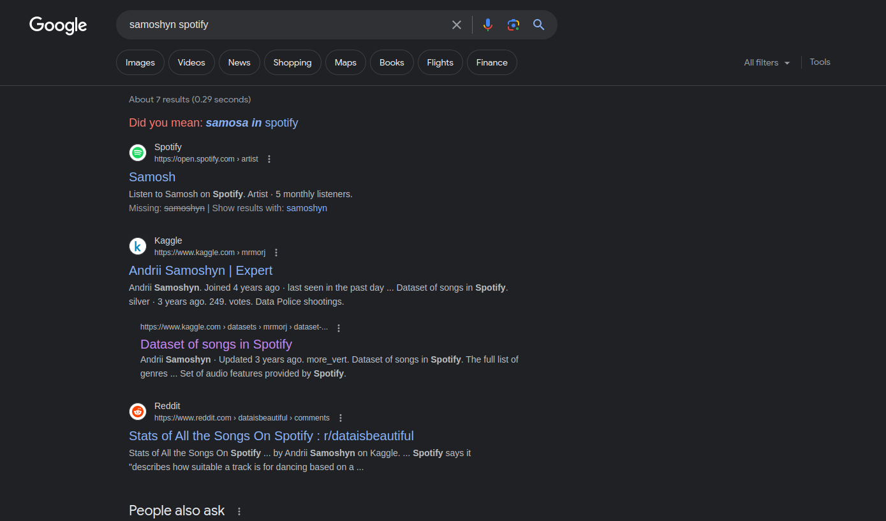

# Solution

Pay close attention to the challenge description. It mentions Spotify, Samoshyn and a precise time of 118168 milliseconds.
<br />

Upon Googling Samoshyn Spotify, we find . Upon observing, we see that Dataset of Songs in Spotify is what is going to be of use to us.
<br />

Download the spotify song dataset and open it. There are 2 csv files - genres_v2.csv and playlists.csv

Obviously, we have to look at the genres_v2.csv file. Upon opening, we can see that there is a column called duration_ms. There we just search for 118168ms. Do this using Ctrl+F(will be easier)
<br />

We can see that there is just one song - Boneless and this is our flag.
<br />

The flag is:
```
ZENSE{boneless}
```